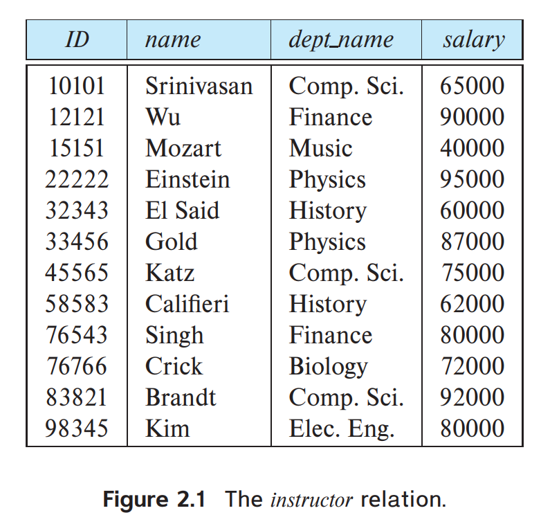
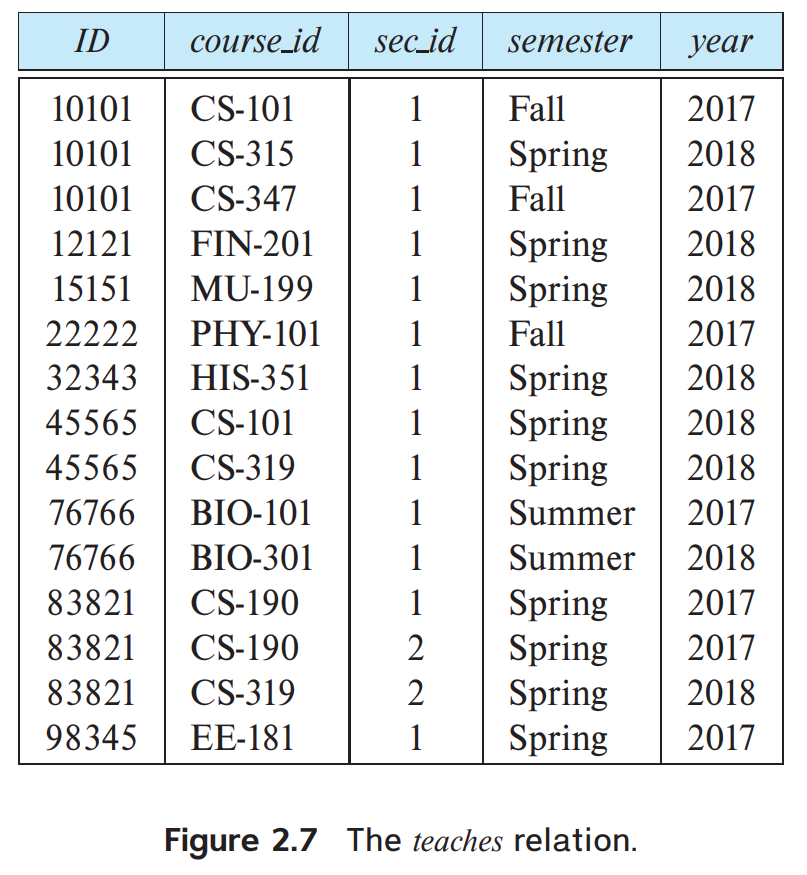
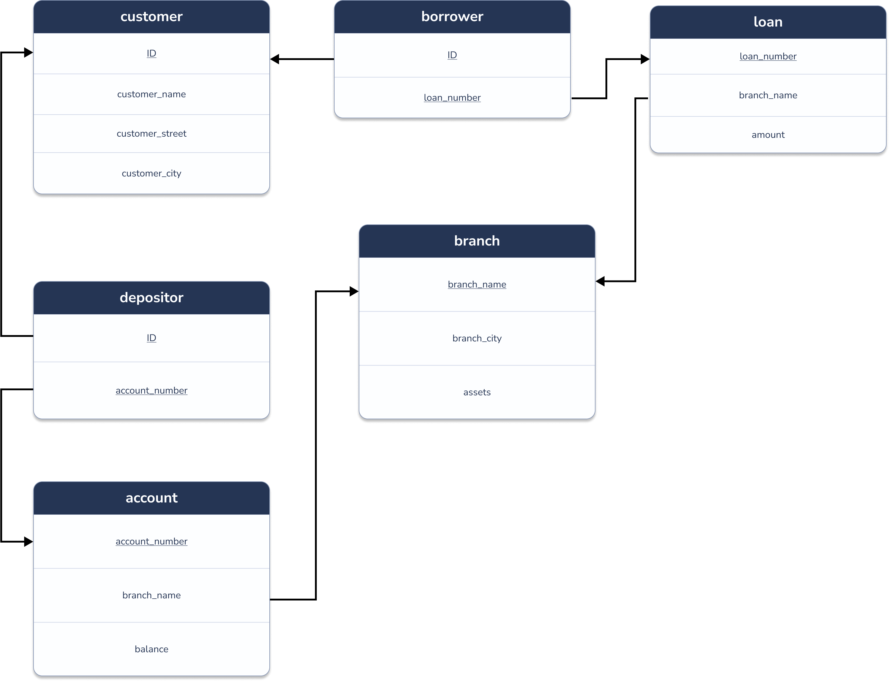
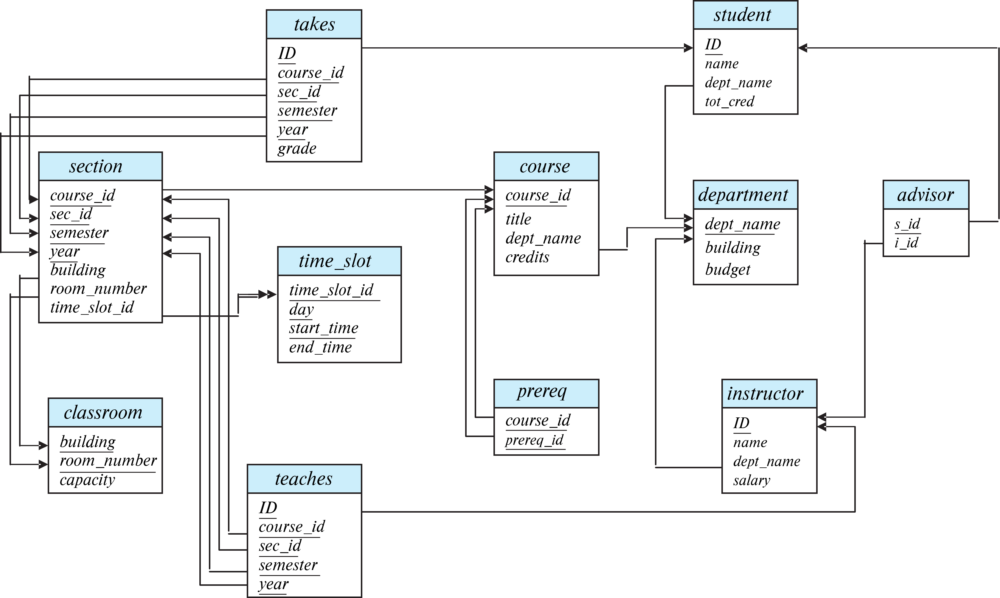

# Chapter 2: Introduction to the Relational Model

> 2.1 Consider the employee database. What are the appropriate primary key
The appropriate primary keys are shown below: 

employee(<u>person_name</u>, street, city)  
works(<u>person_name</u>, company_name, salary)  
company(<u>company_name</u>, city)

--------------------------------
> 2.2 Consider the foreign-key constraint from the *dept_name* attribute of *instructor* to the *department* relation. Give examples of inserts and deletes to these relations that can cause a violation of the foreign-key constraint.

* Insert a tuple  
    (10111, Ostrom, Economics, 110000)  
into the _instructor_ table, where the _department_ table does not 
have the department _Economics_, would violate the foreign-key constraint. 

* Delete the tuple  
    (Biology, Watson, 90000)  
from the _department_ table, where at least one _student_ or _instructor_ tuple has _dept_name_ as Biology, would violate the foreign-key constraint. 

--------------------------------
> 2.3 Consider the _time_slot_ relation. Given that a particular time slot can meet more than once in a week, explain why _day_ and _start_time_ are part of the primary key of this relation, while _end_time_ is not. 

The attributes _day_ and _start_time_ are part of the primary key
since a particular class will most likely meet on several different 
days and may even meet more than once in a day. However, _end_time_
is not part of the primary key since a particular class that starts
at a particular time on a particular day cannot end at more than one time. 

--------------------------------

  

> 2.4 In the instance of _instructor_ shown in Figure 2.1, no two instructors have the same name. From this, can we conclude that _name_ can be used as a superkey (or primary key) of _instructor_? 

No. For this possible instance of the instructor table the names are unique, but in general this may not always be the case (unless the university has a rule that two instructors cannot have the same name, which is a rather unlikely scenario).

--------------------------------
> 2.5 What is the result of first performing the Cartesian product of _student_ and _advisor_, and then performing a selection operation on the result with the predicate _s_id_ = ID? (Using the symbolic notation of relational algebra, this query can be written as $\sigma_{s\_id = ID}(student \times advisor)$.)

The result attributes include all attribute values of _student_ followed by all attributes of _advisor_. The tuples in the result are as follows: For each student who has an advisor, the result has a row containing the student's attributes, followed by _s_id_ attribute identical to the student's ID attribute, followed by the _i_id_ attribute containing the ID of the students advisor.

Students who do not have an advisor will not appear in the result. A student who has more than one advisor will appear a corresponding number of times in the result.

--------------------------------

  

> 2.6 Consider the employee database of Figure 2.17. Give an expression in the relational algebra to express each of the following queries:  
>     a. Find the name of each employee who lives in city "Miami".   

$\Pi_{person\_name}(\sigma_{city = "Miami"}(employee))$  

>     b. Find the name of each employee whose salary is greater than $100000  

$\Pi_{person\_name}(\sigma_{salary > 100000}(employee \bowtie works))$  

>     c. Find the name of each employee who lives in "Miami" and whose salary is greater than $100000.  

$\Pi_{person\_name}(\sigma_{salary > 100000 \wedge city = "Miami"}(employee \bowtie works))$  

--------------------------------
> 2.7 Consider the bank database of Figure 2.18. Give an expression in the relational algebra for each of the following queries:  
> a. Find the name of each branch located in "Chicago".  

$\Pi_{branch\_name}(\sigma_{branch\_city = "Chicago"}(branch))$  

> b. Find the ID of each borrower who has a loan in branch "Downtown".  

$\Pi_{ID}(\sigma_{branch\_name = "Downtown"}(loan \bowtie_{loan.loan\_number = borrower.loan\_number} borrower))$  

--------------------------------
> 2.8 Consider the employee database of Figure 2.17. Give an expression in the relational > algebra to express each of the following queries: 
> a. Find the ID and name of each employee who does not work for "BigBank.  

To find employees who do not work for BigBank, we first find all those
who _do_ work for BigBank. Those are exactly the employees _not_ part of the 
desired result. We then use set difference to find the set of all employees minus
those employees that should not be in the result. 
 

$\Pi_{ID, person\_name}(employee) - \Pi_{ID, person\_name}(
    employee \bowtie_{employee.ID = works.ID} (\sigma_{company\_name="BigBank"}(works))
)$  

> b. Find the ID and name of each employee who earns at least as much as  every employee in the database.  

We use the same approach as in part _a_ by first finding those employees
who do not earn the highest salary, or, said differently, for whom some other
employees earns more. Since this involves comparing two employee salary values, 
we need to reference the _employee_ relation twice and therefore use renaming. 
 

$\Pi_{ID, person\_name}(employee) - \Pi_{A.ID, A.person\_name}(\rho_A(employee) 
\bowtie_{A.salary < B.salary} \rho_B(employee))$

Comment: This is the answer that is provided [here](https://www.db-book.com/Practice-Exercises/PDF-practice-solu-dir/2.pdf). But if you look at Figure 2.17 closely the _employee_
relation doesn't have an attribute called _salary_. 

--------------------------------
> 2.9 The **division operator** of relational algebra, "$\div$" is defined as follows. 
> Let $r(R)$ and $s(S)$ be relations, and let $S \subseteq R$; that is, every attribute
> of schema $S$ is also in schema $R$. Given a tuple $t$, let $t[S]$ denote the projection
> of tuple $t$ on the attributes in $S$. Then $r \div s$ is a relation on schema $R - S$ 
> (that is, on the schema containing all attributes of schema $R$ that are not in schema $S$). 
> A tuple $t$ is in $r \div s$ if and only if both of two conditions hold: 
> * $t$ is in $\Pi_{R-S}(r)$
> * For every tuple $t_s$ in $s$, there is a tuple $t_r$ in $r$ satisfying both of the
> following:  
>     a. $t_r[S] = t_s[S]$  
>     b. $t_r[R - S] = t$  
>  
> 
> Given the above definition: 
> 
> a. Write a relational algebra expression using the division operator to find > the IDs of all students who have taken all Comp. Sci. courses. (Hint: project _takes_ to just ID and _course_id_, and generate the set of all Comp. Sci. _course_id_ s using a select expression, before doing the division.)  

$\Pi_{ID,course\_id}(takes) \div \Pi_{course\_id}(\sigma_{dept\_name = 'Comp. Sci'}(course))$
 

> b. Show how to write the above query in relational algebra, without using division.(By doing so, you would have shown how to define the division operation using the other relational algebra operations.) 

The required expression is as follows: 

$$
\begin{aligned}
    r \leftarrow \Pi_{ID,course\_id}(takes) \\\\
    s \leftarrow \Pi_{course\_id}(\sigma_{dept\_name = 'Comp. Sci'}(course)) \\\\
    \Pi_{ID}(takes) - \Pi_{ID}((\Pi_{ID}(takes) \times s) - r)
\end{aligned}
$$

In general, let $r(R)$ and $s(S)$ be given, with $S \subseteq R$. Then we 
can express the division operation using basic relational algebra operations 
as follows: 
$$
    r \div s = \Pi_{R-S}(r) - \Pi_{R-S}((\Pi_{R-S}(r) \times s) - \Pi_{R-S, S}(r))
$$

To see that this expression is true, we observe that $\Pi_{R-S}(r)$ gives us all 
tuples $t$ that satisfy the first condition of the definition of division. The expression
on the right side of the set difference operator
$
    \Pi_{R-S}((\Pi_{R-S}(r) \times s) - \Pi_{R-S, S}(r))
$
serves to eliminate those tuples that fail to satisfy the second condition of the 
definition of division. Let us see how it does so. Consider $\Pi_{R-S}(r) \times s$.
This relation is on schema $R$, and pairs every tuple in $\Pi_{R-S}(r)$ with 
every tuple in $s$. The expression $\Pi_{R-S,S}(r)$ merely reorders the attributes 
of $r$. 

Thus, $(\Pi_{R-S}(r) \times s) - \Pi_{R-S, S}(r)$ gives us those pairs of tuples
from $\Pi_{R-S}(r)$ and $s$ that do not appear in $r$. If a tuple $t_j$ is in 
$
    \Pi_{R-S}((\Pi_{R-S}(r) \times s) - \Pi_{R-S, S}(r))
$
then there is some tuple $t_s$ in $s$ that does not combine with tuple $t_j$
to form a tuple in $r$. Thus, $t_j$ holds a value for attributes $R - S$ that does
not appear in $r \div s$. It is these values that we eliminate from $\Pi_{R-S}(r)$.

--------------------------------
> 2.10 Describe the differences in meaning between the terms _relation_ and _relation schema_. 

_relation_ is a set of tuples. 

_relation schema_ is used to refer to the the structure of a relation. A _relation schema_ 
consists of a list of attributes and their corresponding domains. 

--------------------------------
> 2.11 Consider the _advisor_ relation shown in the schema diagram in Figure 2.9, with _s_id_ as the primary key of _advisor_. Suppose a student can have more than one advisor. Then, would _s_id_ still be a primary key of the _advisor_ relation? If not, what should the primary key of _advisor_ be? 

_s_id_ alone  **cannot** be a primary key of the _advisor_ relation, since it
doesn't identify uniquely a tuple in the relation _advisor_ (It is possible 
for one student to have many advisors).

> 2.12 Consider the bank database of Figure 2.18. Assume that branch names and customer names uniquely identify branches and customers, but loans and accounts can be associated with moren than one customer.  
> a. What are the appropriate primary keys? 

|Relation Name|Primary key|
|-------------|-----------|
|branch|branch_name|
|customer|ID|
|loan|loan_number|
|borrower|{ID, loan_number}|
|account|account_number|
|depositor|{ID, account_number}|

> b. Given your choice of primary keys, identify appropriate foreign keys. 
 
|Relation Name|Foreign key|
|-------------|-----------|
|branch|No Foreign Key|
|customer|No Foreign Key|
|loan|branch_name|
|borrower|**ID** - a foreign key referencing **customer** relation, **loan_number** - a foreign key referencing **loan** relation|
|account|branch_name|
|depositor|**ID** - a foreign key referencing **customer** relation, **account_number** - a foreign key referencing **account** relation|

--------------------------------
> 2.13 Construct a schema diagram for the bank database of Figure 2.18.

  

the above picture was created using [figma](https://www.figma.com) and [Arctype](https://www.youtube.com/watch?v=bND5cWmk_nk)

--------------------------------
> 2.14 Consider the employee database of Figure 2.17. Give an expression in the relational algebra to express each of the following queries:

We assume that there is an **ID** attribute on the **employee** relation.

We also assume that the attributes **person_name** and **company_name** are UNIQUE in the relations **employee** and **company** respectively. 

> a. Find the ID and name of each employee who works for "BigBank". 

$\Pi_{ID, person\_name}(employee \bowtie_{employee.person\_name = works.person\_name} \sigma_{company\_name="BigBank"}(works))$

> b. Find the ID, name, and city of residence of each employee who works for "BigBank". 

$\Pi_{ID, person\_name, city}(employee \bowtie_{employee.person\_name = works.person\_name} \sigma_{company\_name="BigBank"}(works))$

> c. Find the ID, name, street address, and city of residence of each employee who works for "BigBank" and earns more than $10000.

$\Pi_{ID, person\_name, street, city}(employee \bowtie_{employee.person\_name = works.person\_name} \sigma_{company\_name="BigBank" \wedge salary > 10000 }(works))$

> d. Find the ID and name of each employee in this database who lives in the same city as the company for which she or he works.  

Method 1: 

$$S1 \leftarrow (company \bowtie_{company.company\_name = works.company\_name} works)$$

$$\Pi_{ID, person\_name} (S1 \bowtie_{S1.person\_name = employee.person\_name \wedge S1.city = employee.city} employee))$$

Method 2: 

$$\Pi_{ID, person\_name}(employee \bowtie_{employee.person\_name = works.person\_name} works \bowtie_{works.company\_name = company.company\_name \wedge employee.city = company.city} company)$$

--------------------------------
> 2.15 Consider the bank database of Figure 2.18. Give an expression in the relational algebra for each of the following queries: 
> a. Find each loan number with a loan amount greater than $10000.

$\Pi_{loan\_number}(\sigma_{amount > 10000}(loan))$

> b. Find the ID of each depositor who has an account with a balance > greater than $6000.

$\Pi_{ID}(depositor \bowtie_{depositor.account\_number = account.account\_number} (\sigma_{balance > 6000}(account)))$

> c. Find the ID of each depositor who has an account with a balance greater than $6000 at the "Uptown" branch.  

$\Pi_{ID}(depositor \bowtie_{depositor.account\_number = account.account\_number} (\sigma_{balance > 6000 \wedge branch\_name = "Uptown"}(account) ))$

--------------------------------
> 2.16 List two reasons why null values might be introduced into a database. 

1. When a value of an attribute is unknown.
2. When a value of an attribute does not exist.

--------------------------------
> 2.17 Discuss the relative merits of imperative, functional, and declarative languages. 

Merits of imperative languages
* Easy to read
* Conceptual model (solution path) is very easy for beginners to understand. 
* Characteristics of specific applications can be taken into account. 
[for more](https://www.ionos.com/digitalguide/websites/web-development/imperative-programming/)

Mertis of functional languages
* Lazy Evaluation
* Seamless Parallel Programming
[for more](https://en.wikipedia.org/wiki/Functional_programming)

Merits of declarative languages
* easy to use (since you only tell what you need). 

--------------------------------

  

> 2.18 Write the following queries in relational algebra, using the university schema. 
> a. Find the ID and name of each instructor in the Physics department.

$\Pi_{ID, name}(\sigma_{dept\_name = "Physics"}(instructor))$

> b. Find the ID and name of each instructor in a department located in the building "Watson".

$\Pi_{ID, name}(instructor \bowtie_{instructor.dept\_name = department.dept\_name} (\sigma_{building = "Watson"}(department)))$

> c. Find the ID and name of each student who has taken at least one course in the "Comp. Sci." department.

$\Pi_{student.ID, student.name}(\sigma_{dept\_name = "Comp. Sci"}(student \bowtie_{student.ID = takes.ID} takes \bowtie_{takes.course\_id = course.course\_id} course))$

> d. Find the ID and name of each student who has taken at least one course section in the year 2018.

$\Pi_{student.ID, student.name}(\sigma_{year = 2018}(student \bowtie_{student.ID = takes.ID} takes)$

> e. Find the ID and name of each student who has not taken any course section in the year 2018.

$\Pi_{ID, name}(student) - \Pi_{student.ID, student.name}(\sigma_{year = 2018}(student \bowtie_{student.ID = takes.ID} takes)$

--------------------------------